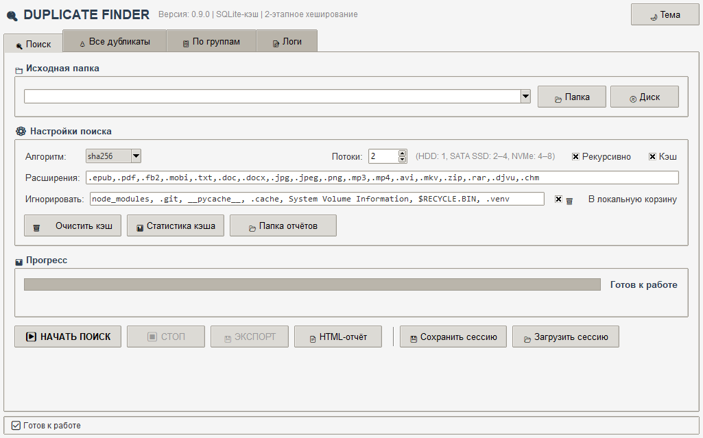
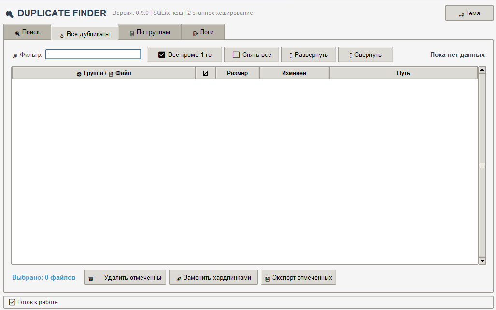
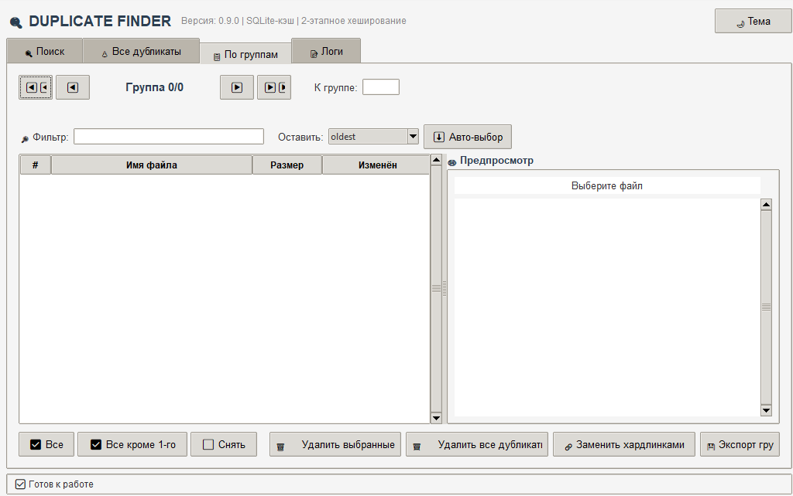
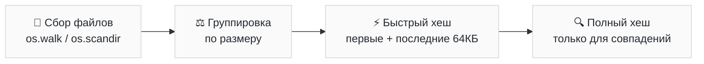

# ANDUP · Duplicate Finder
> **ANDUP** (сокр. от *ANtiDUPlicator*) — авторский проект, название которого
> подчёркивает его отличие от типовых «Duplicate Finder»-клонов. \
> Интеллектуальный поиск и управление дубликатами файлов с графическим интерфейсом.

[](https://www.python.org/)
[](LICENSE)
[](#️-совместимость)
[](https://github.com/R0M10/andup/releases)

**Duplicate Finder** — десктопное приложение для поиска, просмотра и безопасного удаления дубликатов файлов. Оптимизировано для работы с большими коллекциями (книги, фото, музыка, документы) на HDD и SSD.

## 📑 Содержание

- [Возможности](#-возможности)
- [Скриншоты](#-скриншоты)
- [Требования](#-требования)
- [Установка](#-установка)
- [Быстрый старт](#-быстрый-старт)
- [Горячие клавиши](#️-горячие-клавиши)
- [Как это работает](#️-как-это-работает)
- [Обратная связь](#-обратная-связь)
- [Благодарности](#-благодарности)
- [Похожие проекты](#-похожие-проекты)
- [Лицензия](#-лицензия)


---

## ✨ Возможности

### 🔎 Поиск
- **Двухэтапное хеширование** — сначала быстрый хеш первых/последних 64 КБ, только потом полный. В разы меньше чтения с диска.
- **Три алгоритма**: MD5, SHA-1, SHA-256.
- **Предварительная группировка по размеру** — файлы с уникальными размерами исключаются сразу.
- **Многопоточность** с батчингом задач (`ThreadPoolExecutor`).
- **SQLite-кэш хешей** — повторные запуски почти мгновенные, старт не тормозит.
- **Игнор-лист папок** (`node_modules`, `.git`, `System Volume Information`, …).
- **Фильтр по расширениям** — сканируйте только то, что нужно.
- **Рекурсивный и плоский режим**.

### 🌲 Управление дубликатами
- **Два режима просмотра:**
  - «Все дубликаты» — все группы одним списком с чекбоксами.
  - «По группам» — пошаговый разбор с панелью предпросмотра.
- **Миниатюры картинок** в общем списке (загружаются в фоне).
- **Чекбоксы ☑** — отмечайте файлы кликом или через `Space`.
- **Массовые операции** — «Все кроме 1-го» в один клик.
- **Авто-выбор эталона** по стратегии: самый старый / новейший / короткий путь / длинный путь.
- **Предпросмотр** — картинки, текстовые файлы, метаданные.
- **Фильтр по путям** внутри группы.

### 🛡️ Безопасность
- **Корзина вместо удаления** — через [Send2Trash](https://github.com/arsenetar/send2trash) (системная корзина) или локальную папку `DuplicateFinder_Trash/`.
- **Защита системных путей** (`C:\Windows`, `/usr`, `/bin`, …) и опасных расширений (`.exe`, `.dll`, `.sys`).
- **Подтверждения** для каждой массовой операции.
- **🔗 Замена хардлинками** — вместо удаления можно заменить дубликаты жёсткими ссылками: место освободится, файлы останутся доступны по всем путям.
- **Сохранение сессии** — нашли сегодня, разгребли завтра.

### 💾 Экспорт
- JSON, CSV, TXT, HTML-отчёт с превью картинок.
- Экспорт отдельной группы или выбранных файлов.
- Автоматические отчёты в `DuplicateFinder_Reports/`.

### 🎨 Интерфейс
- Светлая / тёмная тема (сохраняется).
- Горячие клавиши.
- Сохранение геометрии окна, последних путей, настроек.
- Лог операций в файл `duplicate_finder.log`.
- Полностью русифицирован.

---

## 📸 Скриншоты

> Скриншоты из v0.9.0 на Windows 11 (светлая тема).

**Вкладка «Поиск»**



**Вкладка «Все дубликаты»**



**Вкладка «По группам»**


---

## 📋 Требования

- **Python 3.8+**
- **Tkinter** (обычно идёт с Python; на Linux может понадобиться отдельно)
- Опционально:
  - [Send2Trash](https://pypi.org/project/Send2Trash/) — для удаления в системную корзину
  - [Pillow](https://pypi.org/project/Pillow/) — для миниатюр картинок

> 💡 Программа работает и без зависимостей: без Send2Trash файлы пойдут
> в локальную `DuplicateFinder_Trash/`, без Pillow — не будет превью.


### Установка Tkinter (Linux)
```bash
# Debian/Ubuntu
sudo apt install python3-tk
# Fedora
sudo dnf install python3-tkinter
# Arch
sudo pacman -S tk
```

## 🚀 Установка

1. **Клонируйте репозиторий** и перейдите в папку проекта:
   ```bash
   git clone https://github.com/R0M10/andup.git
   cd andup
   ```

2. **Установите зависимости** (необязательно, но крайне рекомендуется):
   ```bash
   pip install Send2Trash Pillow
   ```

### 📦 Зависимости и их роль

Программа написана на чистом Python и запустится даже без установки дополнительных библиотек, но их наличие расширяет возможности:

| Библиотека | Если установлена | Если отсутствует |
| :--- | :--- | :--- |
| **`Send2Trash`** | ✅ Удаляет файлы напрямую в **системную корзину** ОС | 📁 Перемещает файлы в локальную папку `DuplicateFinder_Trash/` |
| **`Pillow`** | 🖼️ Включает отображение **миниатюр картинок** и превью в интерфейсе | ❌ Эскизы изображений отображаться не будут |

## 🎯 Быстрый старт

1. **Запустите программу** любым удобным способом:
   - двойным кликом по `DuplicateFinder.py` (Windows, macOS);
   - или из терминала:
     ```bash
     python DuplicateFinder.py
     ```
2. **Выберите папки** или целый диск для сканирования.
3. **Настройте фильтры:** при необходимости укажите расширения файлов и заполните игнор-лист.
4. Нажмите кнопку <kbd>▶️ НАЧАТЬ ПОИСК</kbd>.
5. **Дождитесь завершения:** программа автоматически перенаправит вас на вкладку **«🌲 Все дубликаты»**.
6. **Выберите файлы:** отметьте ненужные копии чекбоксами.
7. **Очистите место:** удалите дубликаты в корзину или замените их **хардлинками** (жесткими ссылками) для экономии пространства без потери файлов.

## ⌨️ Горячие клавиши

| Клавиши | Действие |
| :--- | :--- |
| <kbd>F5</kbd> | Запустить поиск |
| <kbd>Esc</kbd> | Остановить поиск |
| <kbd>Ctrl</kbd> + <kbd>←</kbd> / <kbd>Ctrl</kbd> + <kbd>→</kbd> | Предыдущая / следующая группа |
| <kbd>Ctrl</kbd> + <kbd>Home</kbd> / <kbd>Ctrl</kbd> + <kbd>End</kbd> | Первая / последняя группа |
| <kbd>Ctrl</kbd> + <kbd>S</kbd> | Сохранить сессию |
| <kbd>Ctrl</kbd> + <kbd>O</kbd> | Загрузить сессию |
| <kbd>Space</kbd> | Отметить/снять выделенные файлы (в «Все дубликаты») |
| <kbd>Delete</kbd> | Удалить выделенные |
| **Двойной клик** | Открыть файл |
| **ПКМ** | Контекстное меню |

> 💡 **Примечание:** В полях ввода (Entry) горячие клавиши игнорируются, чтобы не мешать редактированию.


## 🏗️ Как это работает

### Пайплайн поиска



* **Шаг 1. Сбор файлов:** Быстрый обход директорий через os.walk / os.scandir.
* **Шаг 2. Группировка по размеру:** Мгновенно отсеивает абсолютно уникальные файлы.
* **Шаг 3. Быстрый хеш:** Отсеивает еще ~90% кандидатов, считывая только заголовки и хвосты файлов.
* **Шаг 4. Полный хеш:** Выполняет точную финальную проверку только для оставшихся совпадений с параллельным кэшированием в SQLite.

### 🚀 Почему это быстро

* **Ноль лишней работы:** Файлы с уникальным размером не хешируются вообще.
* **Экономия ввода-вывода (I/O):** Файлы с уникальным «быстрым» хешем никогда не читаются целиком.
* **Максимальная утилизация процессора:** Полный хеш рассчитывается параллельно в несколько потоков и сохраняется в базу данных.


### ⚡ Кэширование

Для повторных проверок программа использует базу данных `hash_cache.db` (**SQLite** в режиме **WAL**):
* **Составной ключ:** `путь + алгоритм + размер + mtime`. Если файл не изменялся, готовый хеш извлекается из БД за миллисекунды.
* **Оптимизация скорости:** Включен режим `PRAGMA synchronous = NORMAL` и используются батч-коммиты (пакетная запись данных), что минимизирует задержки при работе с диском.

### 💾 Нагрузка на диск и потоки

По умолчанию программа запускается в **2 потока**, что оптимально для классических жестких дисков (HDD) и предотвращает «трешинг» (взаимную блокировку головок диска).
Для максимальной производительности рекомендуется настроить количество потоков в интерфейсе под ваш тип накопителя:
| Тип накопителя | Рекомендуемые потоки | Эффект |
| :--- | :---: | :--- |
| **HDD** (Жесткие диски) | `1` | Исключает перегрузку диска и замедление чтения |
| **SATA SSD** | `2 – 4` | Оптимальный баланс для стандартных твердотельных накопителей |
| **NVMe SSD** | `4 – 8` | Максимальная скорость для быстрых современных накопителей |


## 📁 Файлы, создаваемые программой

| Файл / папка | Назначение |
| :--- | :--- |
| `hash_cache.db` | SQLite-кэш хешей |
| `duplicate_finder_settings.json` | Настройки (тема, пути, потоки, игнор-лист) |
| `duplicate_finder.log` | Лог операций |
| `DuplicateFinder_Reports/` | Автоматические отчёты |
| `DuplicateFinder_Trash/` | Локальная корзина (если не установлен `Send2Trash`) |

## 🖥️ Совместимость

| ОС | Примечания |
| :--- |:--- |
| **Windows 10/11** |`Send2Trash` → системная корзина |
| **Linux** | Требуется `python3-tk`; корзина через `Send2Trash` |
| **macOS** | `Send2Trash` → системная корзина |

---

## 🤝 Обратная связь

Нашли баг или есть идея — открывайте [Issue](https://github.com/R0M10/andup/issues).
К сообщению о баге приложите `duplicate_finder.log` — в нём видна причина.

---

## 🙏 Благодарности

Проект вдохновлён и частично опирается на идеи следующих инструментов:
- **[Send2Trash](https://github.com/arsenetar/send2trash)** — за безопасное удаление через системную корзину.
- **[Pillow](https://python-pillow.org/)** — за работу с изображениями и миниатюрами.

---

## 🔄 Похожие проекты

- [Czkawka](https://github.com/qarmin/czkawka) — быстрый аналог на Rust.
- [Wise Duplicate Finder](https://www.wisecleaner.com/wise-duplicate-finder.html) — Windows, GUI.
- [dupeGuru](https://dupeguru.voltaicideas.net/) — кросс-платформенный, много форматов.

---

## 📄 Лицензия
Проект распространяется под лицензией **MIT**. Подробности — в файле [LICENSE](LICENSE). \
Коротко: можно свободно использовать, изменять и распространять, в том числе в коммерческих целях, при условии сохранения копирайта и текста лицензии.
